# Petite Pension - Site WordPress

Site web pour le cafe-restaurant Petite Pension, Lyon 1er.
Realise avec WordPress + Elementor.

Site en ligne : https://petite-pension.fr

> Note : Le restaurant a ouvert le 10 octobre 2024 et a ferme ses portes le 12 decembre 2025. Les statistiques ci-dessous refletent l activite du site pendant sa periode d exploitation (juillet 2024 - decembre 2025).

---

## Apercu du site

### Page d'accueil
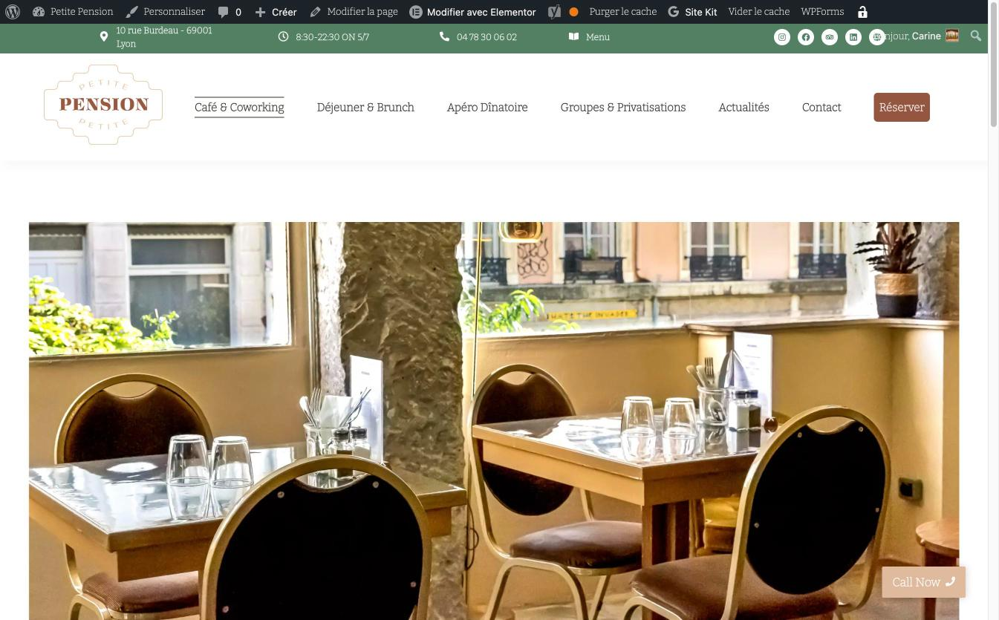

### Apero Dinatoire
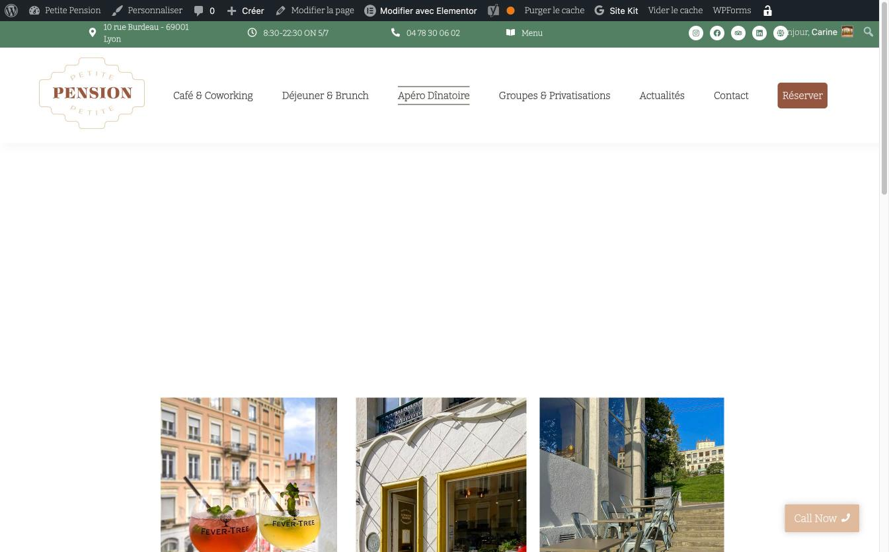

### Groupes et Privatisations
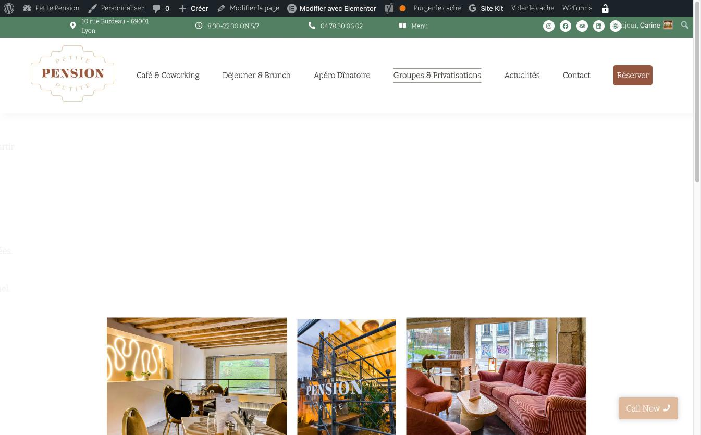

### Page Contact
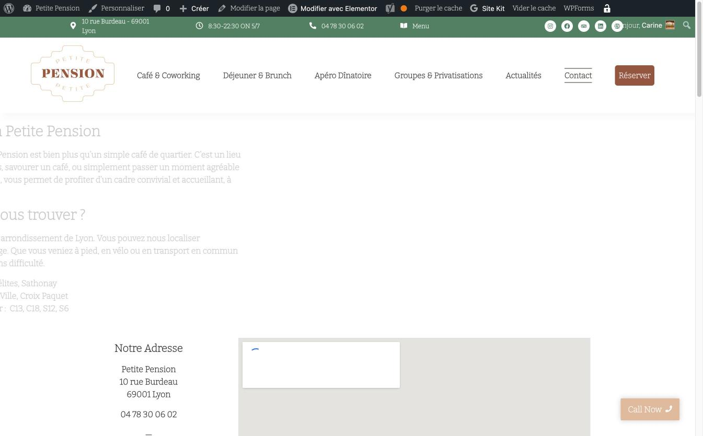

### Tableau de bord WordPress
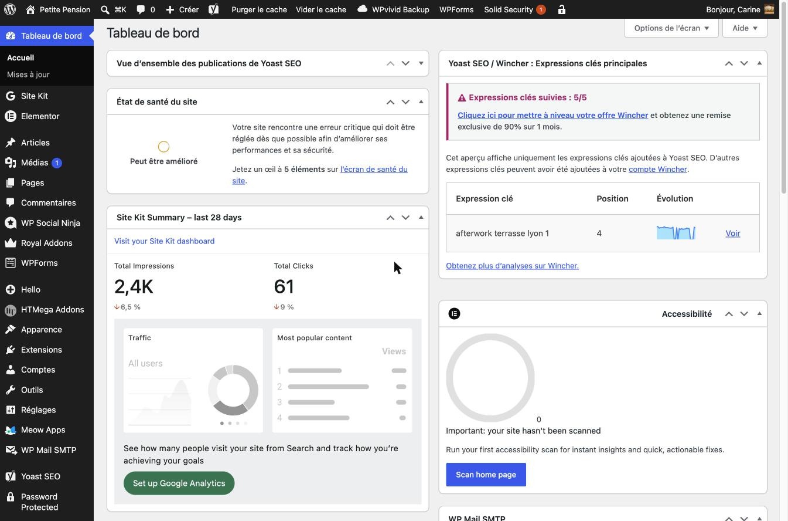

### Plugins installes
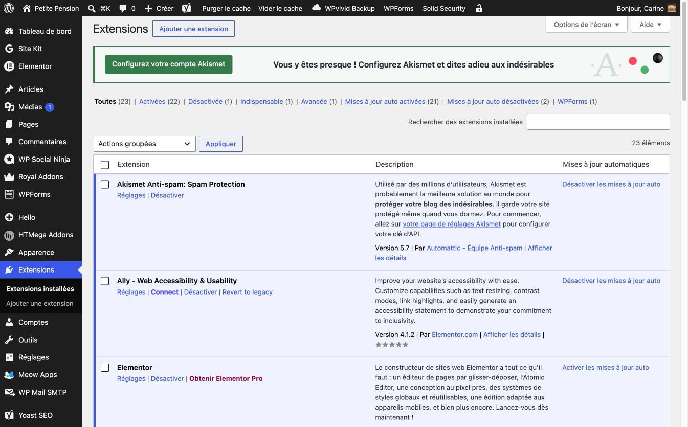

### Theme Hello Elementor
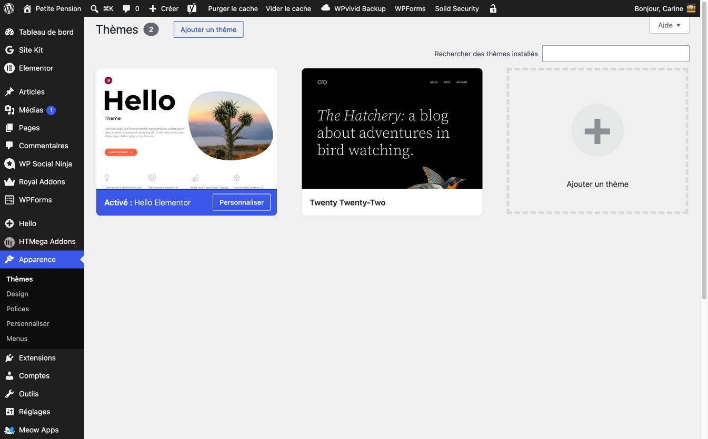

### Interface Elementor
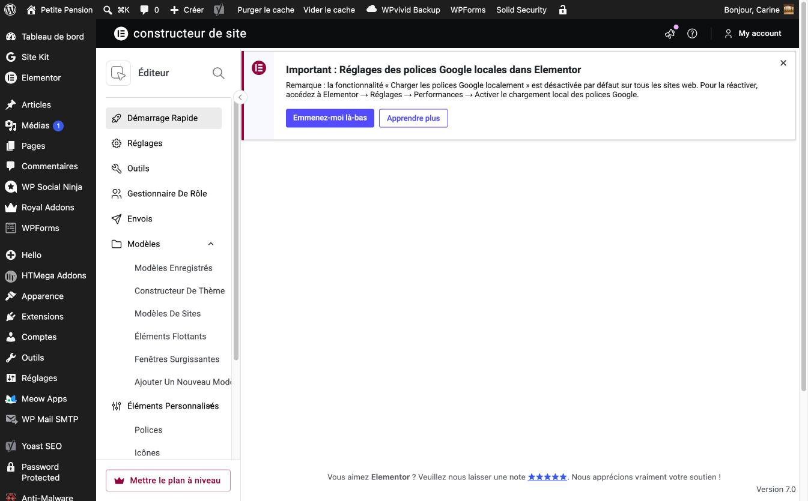

### Dashboard Yoast SEO
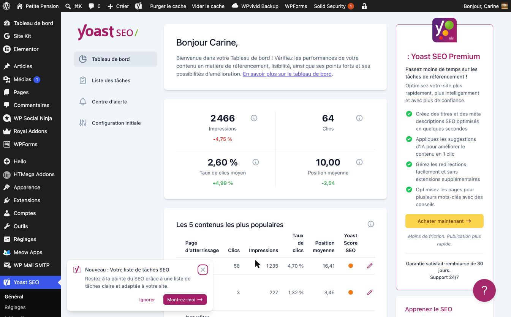

---

## Google Search Console

### Performances sur 16 mois (fev 2025 - mai 2026)
La chute visible a partir de decembre 2025 correspond a la fermeture du restaurant.
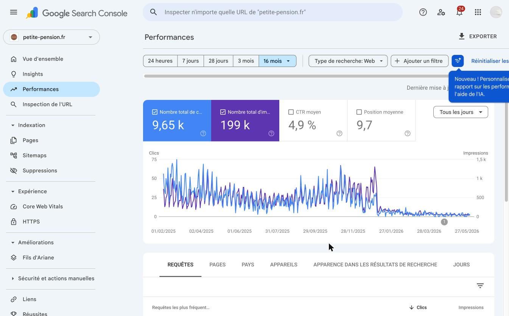

### Detail des 4 metriques cles
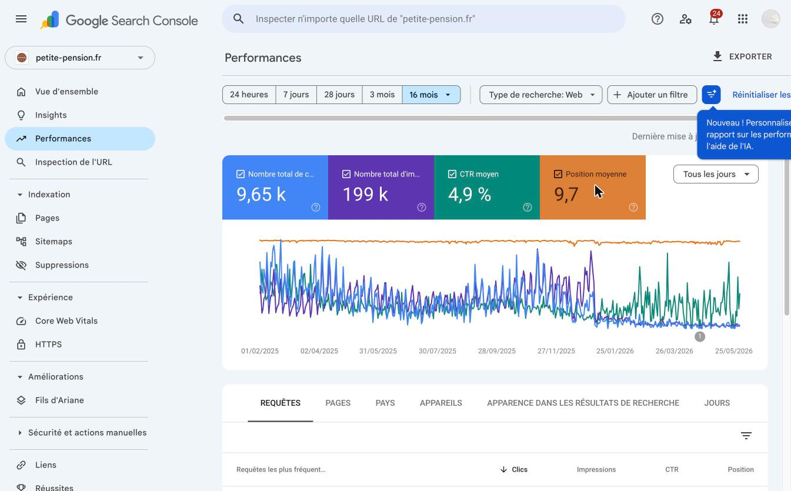

### Requetes les plus frequentes
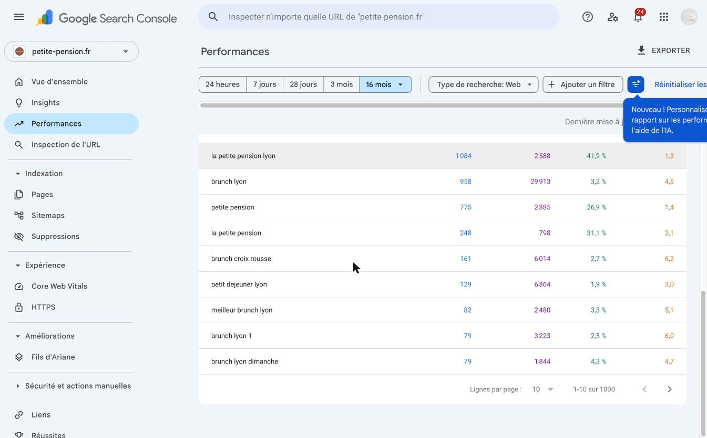

### Sitemap XML soumis a Google
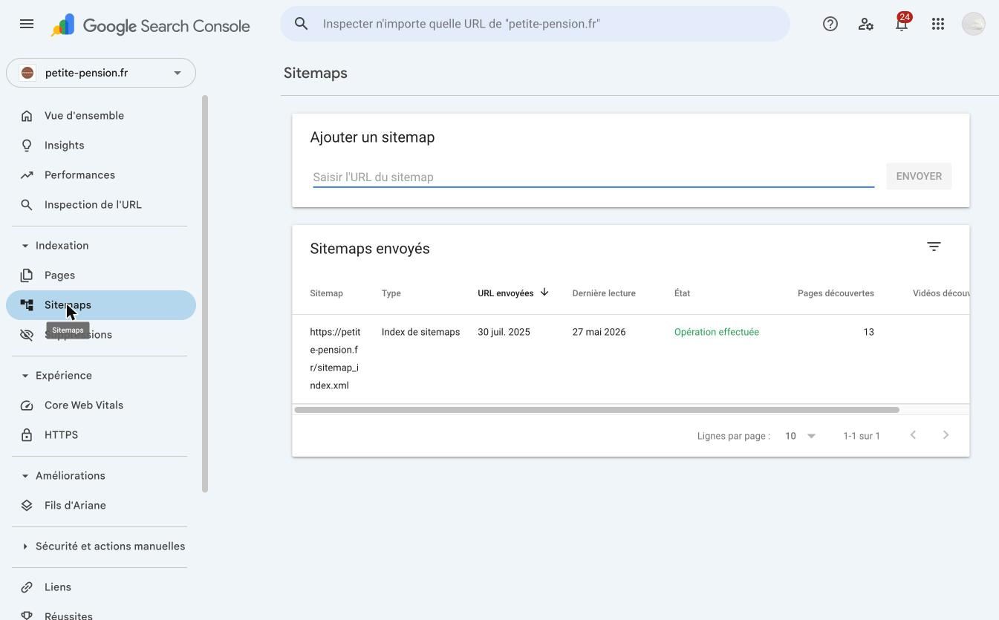

---

## Technologies et outils utilises

| Technologie | Role |
|---|---|
| WordPress 7.0 | CMS principal |
| Elementor v4.1.1 | Constructeur de pages drag and drop |
| Theme Hello Elementor | Theme leger optimise pour Elementor |
| Yoast SEO | Optimisation SEO |
| WPForms Lite | Formulaires de contact |
| WP Mail SMTP | Envoi d emails via SMTP |
| Google Site Kit | Google Analytics et Search Console |
| WP Social Ninja | Flux reseaux sociaux et avis |
| WPvivid Backup | Sauvegardes automatiques |
| Wordfence Security | Securite et pare-feu |
| Solid Security | Securite renforcee |
| WP Super Cache | Mise en cache des pages |
| WP-Optimize | Optimisation BDD et images |
| Image Optimizer | Compression WebP/AVIF |
| Redirection | Gestion redirections 301 et erreurs 404 |
| Royal Elementor Addons | Widgets avances Elementor |
| HT Mega Addons | 135+ widgets Elementor supplementaires |
| Use Any Font | Polices personnalisees |
| Metricool | Analytics et reseaux sociaux |
| Akismet | Protection anti-spam |

---

## Pages creees (9 pages publiees)

| Page | Description |
|---|---|
| Home | Page d accueil - Cafe et Coworking |
| Dejeuner et Brunch | Offre dejeuner, brunch, terrasse |
| Apero Dinatoire | Afterwork et terrasse Lyon 1er |
| Groupes et Privatisations | Privatisation pour evenements |
| Actualites | Blog et evenements |
| Contact | Adresse, horaires, formulaire |
| Menu | Carte complete du restaurant |
| Mentions Legales | Informations legales |
| Declaration d Accessibilite | Accessibilite numerique |

---

## Competences demonstrees

### Construction et design
- Creation de pages 100% visuelles avec Elementor (drag and drop)
- Integration de photos professionnelles du restaurant
- Design responsive (mobile, tablette, desktop)
- Personnalisation du theme Hello Elementor
- Menus de navigation personnalises
- Integration icones reseaux sociaux (Instagram, Facebook, LinkedIn, Tripadvisor)

### SEO et Google Search Console
- Configuration Yoast SEO : titres, meta-descriptions, expressions-cles
- Soumission et suivi du sitemap XML dans Google Search Console
- Suivi des performances de recherche (clics, impressions, CTR, position)
- Expression cle "la petite pension lyon" : 1 084 clics, CTR 41,9%, position 1,3
- Expression cle "brunch lyon" : 958 clics, 29 913 impressions, position 4,6
- Integration Google Search Console via Site Kit

### Performance et securite
- Mise en cache avec WP Super Cache
- Compression images WebP/AVIF automatique
- Optimisation base de donnees avec WP-Optimize
- Protection Wordfence (firewall, scan malware)
- Sauvegardes automatiques avec WPvivid

### Communication et formulaires
- Formulaire de contact WPForms (249 entrees recues)
- Configuration WP Mail SMTP (809 emails envoyes)
- Integration reseaux sociaux avec WP Social Ninja

---

## Resultats Google Search Console (duree de vie du site)

| Metrique | Valeur totale (16 mois) |
|---|---|
| Clics totaux | 9 650 |
| Impressions totales | 199 000 |
| CTR moyen | 4,9 % |
| Position moyenne | 9,7 |

### Top requetes

| Requete | Clics | Impressions | CTR | Position |
|---|---|---|---|---|
| la petite pension lyon | 1 084 | 2 588 | 41,9% | 1,3 |
| brunch lyon | 958 | 29 913 | 3,2% | 4,6 |
| petite pension | 775 | 2 885 | 26,9% | 1,4 |
| la petite pension | 248 | 798 | 31,1% | 2,1 |
| brunch croix rousse | 161 | 6 014 | 2,7% | 6,2 |

### Sitemap XML
- URL soumise : https://petite-pension.fr/sitemap_index.xml
- Soumis le : 30 juillet 2025
- Entreprise ouverte le : 10 octobre 2024
- Entreprise liquidée le : 12 décembre 2025
- Derniere lecture Google : 27 mai 2026
- Pages decouvertes : 13
- Statut : Operation effectuee

---

## Realise par

Carine - Developpeuse WordPress
Lyon, France
GitHub : https://github.com/mcdesmonteix

---

Projet realise de A a Z : configuration hebergement, installation WordPress, creation graphique,
integration Elementor, optimisation SEO, configuration Google Search Console, mise en production.
Le site a ete exploite du juillet 2024 au 12 decembre 2025.
